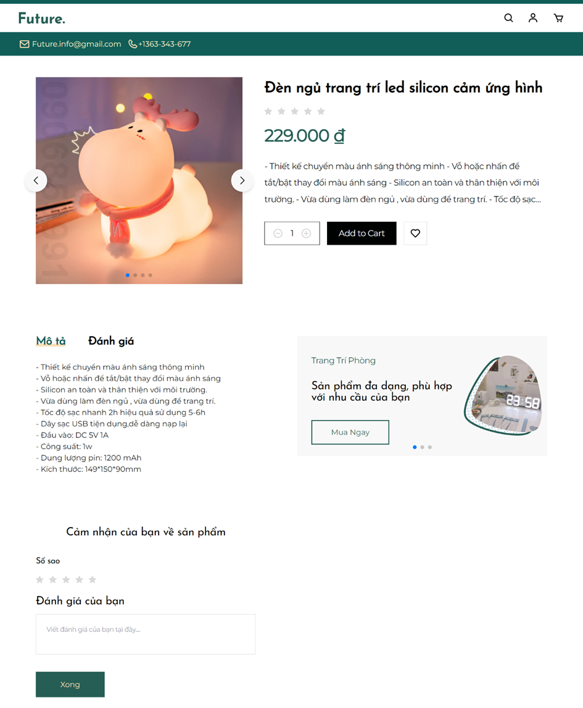
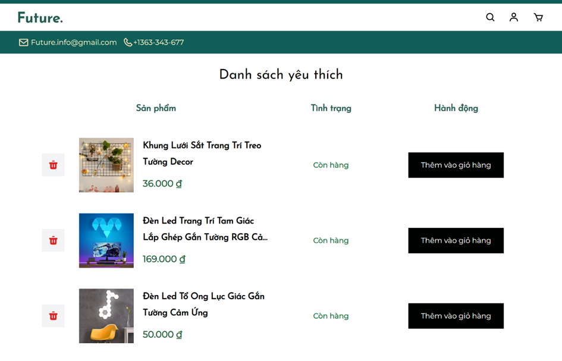

<div align="left">
    <div align="center">
      
      <p>
          This is a website for selling decorations, where customers can find unique and beautiful items to decorate their homes. On the website, we offer a wide range of decorative accessories such as paintings, decorative lights, and much more.
        </p>
    </div>
    <!-- Badges -->
    <br />
    <div align="center">
        <p>
            <a href="https://github.com/hoangan-vn/future/graphs/contributors">
                
            </a>
            <a href="">
                
            </a>
            <a href="https://github.com/hoangan-vn/future/network/members">
                
            </a>
            <a href="https://github.com/hoangan-vn/future/stargazers">
                
            </a>
            <a href="https://github.com/hoangan-vn/future/issues/">
                
            </a>
            <a href="https://github.com/hoangan-vn/future/blob/master/LICENSE">
                
            </a>
        </p>
        <h4>
            <a href="https://github.com/hoangan-vn/future/">View Demo</a>
            <span> · </span>
            <a href="https://github.com/hoangan-vn/future">Documentation</a>
            <span> · </span>
            <a href="https://github.com/hoangan-vn/future/issues/">Report Bug</a>
            <span> · </span>
            <a href="https://github.com/hoangan-vn/future/issues/">Request Feature</a>
        </h4>
    </div>
</div>
<br />

<!-- Table of Contents -->
# :notebook_with_decorative_cover: Table of Contents

- [:notebook\_with\_decorative\_cover: Table of Contents](#notebook_with_decorative_cover-table-of-contents)
  - [:sparkles: About the Project](#sparkles-about-the-project)
    - [:camera: Screenshots](#camera-screenshots)
      - [:handshake: Client](#handshake-client)
      - [:man\_in\_tuxedo: Admin](#man_in_tuxedo-admin)
    - [:space\_invader: Tech Stack](#space_invader-tech-stack)
    - [:dart: Features](#dart-features)
      - [:man\_in\_tuxedo: Admin feature](#man_in_tuxedo-admin-feature)
      - [:handshake: Client features](#handshake-client-features)
    - [:art: Color Reference](#art-color-reference)
    - [:key: Environment Variables](#key-environment-variables)
  - [:toolbox: Getting Started](#toolbox-getting-started)
    - [:gear: Installation](#gear-installation)
  - [:bar\_chart: UseCase](#bar_chart-usecase)
  - [:art: Design](#art-design)
  - [:chart: Class Diagram](#chart-class-diagram)
  - [:warning: License](#warning-license)
  - [:speech\_balloon: Contact](#speech_balloon-contact)
  - [:gem: Acknowledgements](#gem-acknowledgements)

<!-- About the Project -->
## :sparkles: About the Project<a name="sparkles-about-the-project"></a>

<!-- Screenshots -->
### :camera: Screenshots<a name="camera-screenshots"></a>

<!-- Client -->
#### :handshake: Client<a name="handshake-client"></a>

| Login  | Email Verification | Code Verification |
| --- | --- | --- |
|  |  |  |

| Register  | Home Page | Products Page |
| --- | --- | --- |
|  |  |  |

| Product Detail Page  | Profile Page | Address Page |
| --- | --- | --- |
|    |   |  |

| Wish List | Cart | Payment |
| --- | --- | --- |
|  |  |  |

| History | Order Detail |
| --- | --- |
|  |  |

<!-- Admin -->
#### :man_in_tuxedo: Admin<a name="man_in_tuxedo-admin"></a>

| Login  | Home Page | Product Page |
| --- | --- | --- |
|  |  |  |

| Category Page  | Order Page | Profile |
| --- | --- | --- |
|  |  |  |

<!-- TechStack -->
### :space_invader: Tech Stack<a name="space_invader-tech-stack"></a>

<details>
  <summary>Client</summary>
  <ul>
    <li><a href="https://www.typescriptlang.org/">TypeScript</a></li>
    <li><a href="https://react.dev/">ReactJs</a></li>
    <li><a href="https://redux.js.org/">ReduxJs / Redux Toolkit</a></li>
    <li><a href="https://tailwindcss.com/">Tailwind CSS</a></li>
  </ul>
</details>

<details>
  <summary>Admin</summary>
  <ul>
    <li><a href="https://www.typescriptlang.org/">TypeScript</a></li>
    <li><a href="https://nextjs.org/">NextJs</a></li>
    <li><a href="https://redux.js.org/">ReduxJs / Redux Toolkit</a></li>
    <li><a href="https://mui.com/">Meterial UI</a></li>
  </ul>
</details>

<details>
  <summary>Server</summary>
  <ul>
    <li><a href="https://www.typescriptlang.org/">TypeScript</a></li>
    <li><a href="https://expressjs.com/">ExpressJs</a></li>
    <li><a href="https://swagger.io/">Swagger</a></li>
    <li><a href="https://www.mongodb.com/">MongoDB</a></li>
    <li><a href="https://cloudinary.com/">Cloudinary</a></li>
  </ul>
</details>

<details>
<summary>DevOps</summary>
  <ul>
    <li><a href="https://www.gtihub.com/">Github</a></li>
    <li><a href="https://www.gtihub.com/">Github Action</a></li>
    <li><a href="https://vercel.com/">Vercel</a></li>
    </li>
  </ul>
</details>

<!-- Features -->
### :dart: Features<a name="dart-features"></a>

<!-- Admin features -->
#### :man_in_tuxedo: Admin feature<a name="man_in_tuxedo-admin-feature"></a>

- View order list
- Filter orders
- View order details
- Change order status
- Create product
- Edit product
- Delete product
- View product list
- Create product category
- Edit product category
- Delete product category
- View product category list
- Change email
- Change password
- Statistics
- Login to dashboard
- Logout from dashboard

<!-- Client features -->
#### :handshake: Client features<a name="handshake-client-features"></a>

- Login
- Register
- Logout
- View products
- View product details
- Search products
- Filter products
- Add address
- Edit address
- Delete address
- View address list
- View cart
- Change product quantity
- Remove product from cart
- Add product to cart
- Create order
- View order history
- Create comment
- Edit comment
- Delete comment
- Add to wishlist
- View wishlist
- Remove from wishlist
- Edit personal information
- Change password

<!-- Color Reference -->
### :art: Color Reference<a name="art-color-reference"></a>

| Color  | Hex  |
| --- | --- |
| Primary Color |  #265E55 |
| Secondary Color |  #ffffff |
| Accent Color |  #f8dfb6 |
| Text Color |  #000000 |

<!-- Env Variables -->
### :key: Environment Variables<a name="key-environment-variables"></a>

To run this project, you will need to add the following environment variables to your .env file

`PORT`

`MONGO_URL`

`JWT_SECRET`

`APP_ID`

`KEY1`

`KEY2`

`ENDPOINT_CREATE_ORDER`

`ENDPOINT_QUERY_ORDER_STATUS`

`REDIRECT_URL`

`CALLBACK_URL`

`CLOUD_NAME`

`CLOUDINARY_API_KEY`

`CLOUDINARY_API_SECRET`

<!-- Getting Started -->
## :toolbox: Getting Started<a name="toolbox-getting-started"></a>

<!-- Installation -->
### :gear: Installation<a name="gear-installation"></a>

Install node_modules for each project individually

```bash
 yarn
```

<!-- UseCase -->
## :bar_chart: UseCase<a name="bar_chart-usecase"></a>


<!-- Design -->
## :art: Design<a name="art-design"></a>

Figma: [FUTURE.fig](https://www.figma.com/design/QIcKA01wT97w8GW8TWOCgn/FUTURE?node-id=0-1&t=7aB1x3XAWVs9qtUh-1)

<!-- Class Diagram -->
## :chart: Class Diagram<a name="chart-class-diagram"></a>


<!-- License -->
## :warning: License<a name="warning-license"></a>

Distributed under the no License. See ```LICENSE``` for more information.

<!-- Contact -->
## :speech_balloon: Contact<a name="speech_balloon-contact"></a>

Hoang An -  <hoangan072024@gmail.com> - <+84 779672566>

Project Link: [https://github.com/hoangan-vn/future](https://github.com/hoangan-vn/future)

<!-- Acknowledgments -->
## :gem: Acknowledgements<a name="gem-acknowledgements"></a>

In Future project, I used some useful resources and libraries to aid the development process.

- [Desgin Figma](https://www.figma.com/design/QIcKA01wT97w8GW8TWOCgn/FUTURE?node-id=0-1&t=7aB1x3XAWVs9qtUh-1)
- [ReactJs](https://react.dev/)
- [ReduxJs / Redux Toolkit](https://redux.js.org/)
- [NextJs](https://nextjs.org/)
- [ExpressJs](https://expressjs.com/)
- [Tailwind CSS](https://tailwindcss.com/)
- [Meterial UI](https://mui.com/)
- [Swagger](https://swagger.io/)
